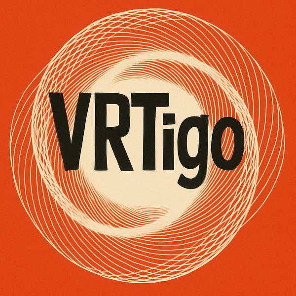

  

# vrtigo

An experimental C++20 VRT I/O library co-authored with AI

## Goals

- Lightweight, header‑only C++20 library for VITA 49.2 packet building and parsing.
- Targeting high-performance and low-latency applications.
- Compile‑time packet definitions with automatic size/structure validation.
- Allocation-free so packets operate entirely on user-provided buffers.
- Clean API for building and parsing VRT packets

## Initial Development

This library was initially co-developed by a half-decent programmer using AI agents such as Claude Code, OpenAI Codex, and GitHub Copilot. This library currently has very little hand-written code.

Initial attempts focused on making fast progress, so AI agents were given a little more leeway than might be given in a production environment. This resulted in some rough edges and a bit of bloat, but the API is quickly stabilizing and interoperability work with continues to prove compliance.

## Development Environment

- C++20
- CMake build system
- Unit tests with GoogleTest
- Makefile wrapper for common tasks
- Continuous Integration with GitHub Actions

